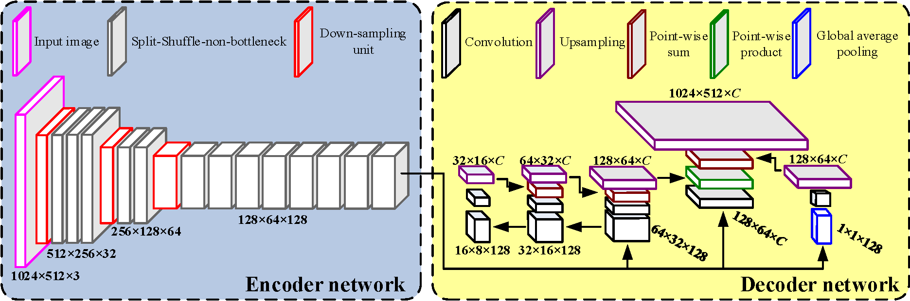

###  Unofficial implementation of LEDNet(https://github.com/xiaoyufenfei/LEDNet) on ADE20K

#### Introduction

This project contains the code of LEDNet supporting ADE20K dataset ( [**LEDNet: A Lightweight Encoder-Decoder Network for Real-time Semantic Segmentation**](https://arxiv.org/pdf/1905.02423.pdf)  by [Yu Wang](https://github.com/xiaoyufenfei))

<p align="center"></p>
LEDNet is a lightweight network, with an asymmetric encoder-decoder architecture for the task of real-time semantic segmentation.

#### Training
- Download the ADE20K scene parsing dataset:
```
cd datasets
chmod +x download_ADE20K.sh
./download_ADE20K.sh
```

-  Adjusting parameter before training, such as GPU ID, learning rate……
```
cd train
python train.py
```

#### Testing
- the trained models will be coming soon

```
cd train
python  test.py
```

#### Results
- coming soon

#### Reference
1. [**LEDNet**](https://github.com/xiaoyufenfei/LEDNet)
2. [**awesome-semantic-segmentation-pytorch**](https://github.com/Tramac/awesome-semantic-segmentation-pytorch)
